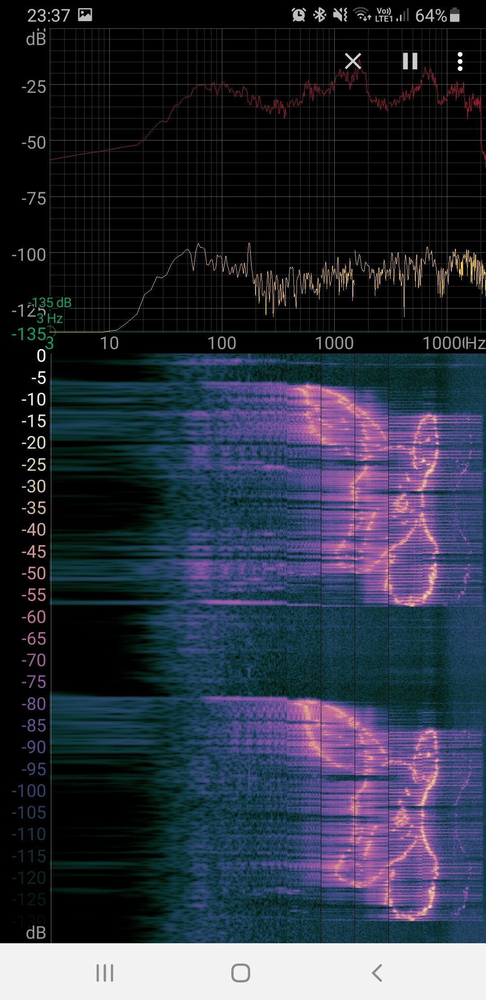

# Image-To-Sound

This project was a one evening proof of concept to find out, if it would be possible to convert pictures into sound, which can then again be made visible with an audio spectrum analyzer over time.

It works best with black and white line drawings and logos.

The resulting sound resembles somewhat R2D2 :-) 

https://pixabay.com/illustrations/coloring-deer-bw-monochrome-line-2518563/

